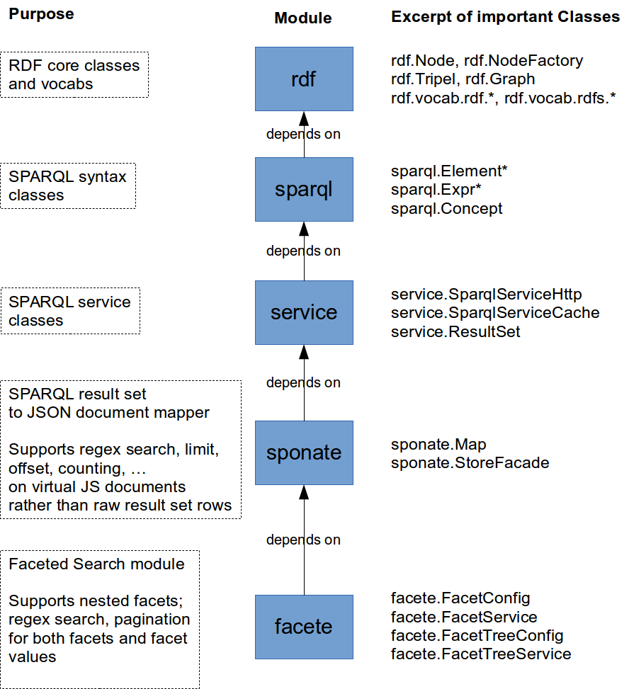

## JAvascript Suite for Sparql Access (Jassa) Core

[](http://badge.fury.io/js/jassa-core) 
[](https://codeclimate.com/github/GeoKnow/Jassa-Core) 
[](https://gemnasium.com/GeoKnow/Jassa-Core)  

* Master branch:  
[](https://travis-ci.org/GeoKnow/Jassa-Core)
[](https://coveralls.io/r/GeoKnow/Jassa-Core?branch=master) 

* Develop branch:  
[](https://travis-ci.org/GeoKnow/Jassa-Core)
[](https://coveralls.io/r/GeoKnow/Jassa-Core?branch=develop)


This library is a swiss army knife for dealing with SPARQL queries and result sets from JavaScript.
It is comprised of a set of layered modules, ranging from a (low-level) RDF API over a service abstraction layer, a SPARQL-JSON mapping layer up to a faceted browsing layer. Jassa lets you focus on application development rather than getting tangled up in SPARQL details.
Note, that Jassa-Core can be used in both server- and client-side scenarios.


## Demos

A good point to get started with Jassa is to have a look at the demos and see what can be achieved and how.
The demos make use of widgets from the related [jassa-ui-angular](https://github.com/GeoKnow/Jassa-UI-Angular) project.

_Data Browsers_

* [Castle-Browser](http://js.geoknow.eu/demos/jassa/sponate/sponate-castles.html)
* [Pokedex-Browser](http://js.geoknow.eu/demos/jassa/pokedex-browser/)
* [Dataset-Browser](http://js.geoknow.eu/demos/jassa/dataset-browser/)

_Faceted Search_

* Coming soon

_Applications_

* [Facete2 Generic SPARQL Browser](http://cstadler.aksw.org/facete2)

## Components and Usage

The `jassa` object defines the following modules, of which each has its own documentation page.

* [rdf](lib/rdf) Core RDF classes closely following the Jena API
* [vocab](lib/vocab) Essential vocabulary definitions
* [sparql](lib/sparql) Classes for the syntactic representation of SPARQL queries
* [sponate](lib/sponate) SPARQL-to-JSON mapping module
* [facete](lib/facete) A powerful faceted search API

An overview of the modules is shown below:




## How to obtain

* npm 

        npm install jassa

* bower; will fetch files from the [jassa-bower release git repo](https://github.com/GeoKnow/Jassa-Bower)

        bower install jassa

## How to build/test

1. Make sure you have latest node.js installed
2. Install [gulp](http://gulpjs.com/) with `npm -g install gulp`
3. Clone this repo
4. `cd` into repo folder and run `npm install`

Now you can run `gulp` to see if the tests complete as well as results for code covarage.

## Browser-based Set Up

TODO: add explanation here

Run `gulp browserify`. Then this minimal example using JQuery and Bluebird works:

```html
<html>
<head>
    <script src="//ajax.googleapis.com/ajax/libs/jquery/2.1.1/jquery.min.js"></script>
    <script src="//cdnjs.cloudflare.com/ajax/libs/bluebird/1.2.2/bluebird.min.js"></script>

    <!--<script src="dist/jassa.min.js"></script>-->
    <script src="dist/jassa.js"></script>

    <script type="text/javascript">
            // Init jassa with native promise and jquery.ajax
            var jassa = new Jassa(Promise, $.ajax);

            // The jassa object is now readily available
            // We hope that the name Jassa is sufficiently exotic to never cause a name clash
            // But who knows. I wished JavaScript had native namespace support...
            console.log("The Jassa object: ", jassa);
        </script>
    </head>
</html>
```

## NodeJs-based Set Up

Example of a nodejs based set up:

```js
// require libraries
var Promise = require('bluebird');
var request = Promise.promisifyAll(require('request'));

// create ajax function for sending requests
var ajax = function(param) {
    return request.postAsync(param.url, {
        json: true,
        form: param.data,
    }).then(function(res) {
        return new Promise(function(resolve) {
            resolve(res[0].body);
        });
    });
};

// init jassa with loaded Promise and ajax request function
var jassa = require('jassa')(Promise, ajax);
```


